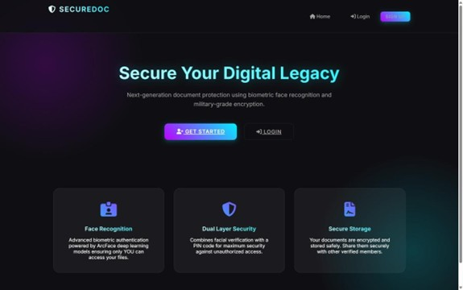
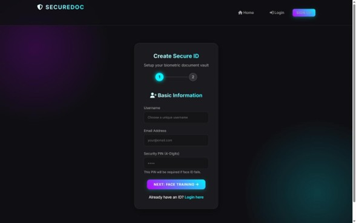
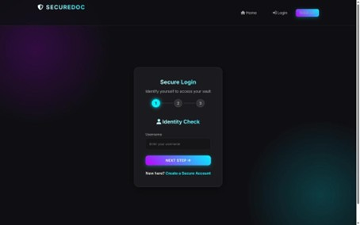
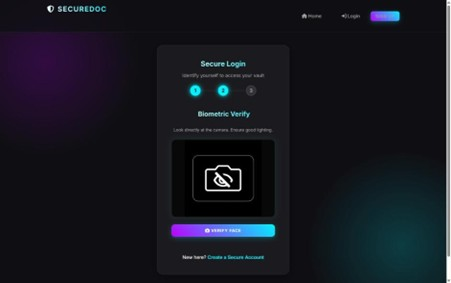
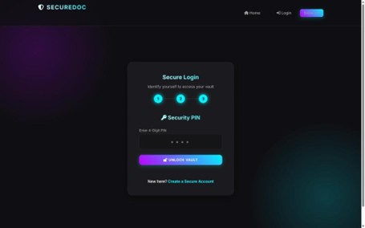

# SecureDoc - Advanced Face Auth Document Vault

SecureDoc is an advanced secure document sharing platform developed with face authentication and encrypted access control to ensure safe document storage and sharing. The system uses AI-based biometric verification, secure cloud storage, and role-based access management to protect confidential files from unauthorized access. Built with modern web technologies and a futuristic user interface, the project focuses on enhancing digital document security and providing a seamless user experience.


## 🚀 Key Features

### 🛡️ Advanced Security
-   **Biometric Dual-Factor**: Face Recognition (AI/DeepFace) + PIN Code Access.
-   **Duress Mode (Panic Protocol)**: Entering the Panic PIN `0000` grants access to a **Fake Empty Dashboard**, hiding your real data in hostage situations.
-   **Matrix Access Logs**: Real-time, scrolling forensic logs monitoring all system activity.

### 💼 Smart Sharing
-   **Self-Destructing Shares**: Share documents with "Top Secret" clearance that **auto-delete after 1 view**.
-   **Time-Limited Access**: "Confidential" shares expire automatically after 24 hours.
-   **Group Sharing**: Share with multiple users instantly using a chip-based interface.

### 💎 Premium UI Experience
-   **Aurora Theme**: Deep, animated 3D background with neon aesthetics.
-   **Glassmorphism 2.0**: High-end frosted glass cards with **3D Tilt & Glare** effects.
-   **Seamless Interaction**: Zero-latency transitions and polished micro-interactions.

## 🛠️ Tech Stack

-   **Frontend**: HTML5, CSS3 (Modern Variables, Animations), Vanilla JS (Vanilla-Tilt.js)
-   **Backend**: Flask (Python)
-   **AI/ML**: DeepFace (TensorFlow/Keras backend) for Face Verification.
-   **Database**: SQLite (Zero-config, fast relational data)

## 9.2 SAMPLE SCREENSHOTS

###  Home Page


---

###  SignUp Page


---

###  Step Login Pages

#### Step 1


#### Step 2


#### Step 3



## ⚡ Quick Start

1.  **Install Dependencies**
    ```bash
    pip install -r requirements.txt
    ```

2.  **Run Application**
    ```bash
    python app.py
    ```

3.  **Access**
    Open `http://localhost:5000`

## 📖 Pro Tips

-   **Panic PIN**: The default Panic PIN is `0000`. Use this to test the **Duress Mode**.
-   **Logs**: Watch the bottom green terminal for live system events.
-   **Mail Testing Log**: OTP mail attempts are now written to `logs/mail_test.log` with success/failure status and error details (emails are masked).
-   **3D Effect**: Move your mouse over cards to see the premium depth effect.

---
*Built for the Future of Secure Data Sharing.*
